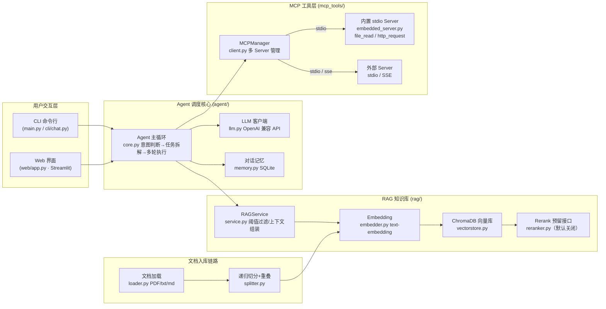

# MyAgent —— 带 RAG 私有知识库 + MCP 工具调用的智能 Agent

一个基于 Python 构建的智能体项目：本地私有知识库（RAG）让大模型"先查库再回答"以降低幻觉；MCP（Model Context Protocol）让 Agent 能调用外部工具（本地文件、HTTP 接口等）补充信息；SQLite 持久化对话记忆，支持多会话。

## 特性一览

| 能力 | 说明 |
| ---- | ---- |
| 📚 RAG 知识库 | 上传 PDF / TXT / MD → 递归切分（带重叠窗口）→ OpenAI Embedding 向量化 → ChromaDB 本地持久化检索 |
| 🎚 相似度阈值过滤 | 检索结果低于 `RAG_SIM_THRESHOLD` 的块会被过滤；无合格结果时返回"知识库信息不足"，驱动 Agent 转向外部工具 |
| 🔁 Rerank 预留 | 已预留重排序扩展接口（默认关闭），后续配置 API Key 即可开启 |
| 🤖 Agent 调度 | LLM 驱动意图判断与任务拆解，多轮 tool-call 循环：先查知识库，信息不足再调 MCP 工具，最后二次汇总回答 |
| 🔌 MCP 工具 | 支持同时连接多个 MCP Server（stdio 本地进程 + SSE 远程）；内置文件读取（路径白名单防穿越）、HTTP 请求两个基础工具 |
| 🧠 对话记忆 | SQLite 单文件持久化，多会话管理，重启不丢失 |
| 💬 CLI 入口 | 命令式交互（含 /upload /documents /delete /sessions /new /tools）；结构上已与 web 层解耦，便于扩展 Streamlit |
| 🖥️ Web 界面 | Streamlit 可视化界面（`streamlit run web/app.py`）：聊天 + 工具调用轨迹展示、知识库上传/删除、会话新建/切换 |

## 项目架构



## 目录结构

```
MyAgent/
├── config.py                    # 全局配置：LLM / Embedding / RAG / MCP / SQLite（密钥统一在此）
├── requirements.txt             # 依赖清单
├── README.md
├── main.py                      # CLI 入口
├── docs/
│   └── TEST_GUIDE.md            # 功能测试文档（RAG / MCP / 记忆测试教程）
├── data/                        # 运行时自动创建
│   ├── documents/               # 上传的原始文档（file_read 白名单目录）
│   ├── chroma_db/               # ChromaDB 向量库持久化目录
│   └── myagent.db               # SQLite 对话记忆库
├── agent/
│   ├── llm.py                   # OpenAI 兼容 LLM 客户端（chat + tool call）
│   ├── memory.py                # SQLite 会话 / 消息持久化
│   └── core.py                  # Agent 主循环（工具调度与汇总）
├── rag/
│   ├── loader.py                # 文档加载（PDF/txt/md）
│   ├── splitter.py              # 递归字符切分 + 重叠窗口
│   ├── embedder.py              # OpenAI text-embedding 封装
│   ├── vectorstore.py           # ChromaDB 入库 / 检索 / 删除
│   ├── reranker.py              # Rerank 预留接口（默认关闭）
│   ├── types.py                 # 共享数据结构
│   └── service.py               # RAGService 文档管理与检索
├── mcp/
│   ├── servers.json             # MCP Server 注册表（可增删）
│   ├── embedded_server.py       # 内置 stdio Server（file_read / http_request）
│   └── client.py                # MCPManager 多 Server 连接与工具转发
├── cli/
│   └── chat.py                  # 异步交互界面
├── web/
│   ├── bridge.py                # 异步桥：后台线程常驻事件循环（供 Streamlit 调用异步业务层）
│   └── app.py                   # Streamlit Web 界面入口
└── utils/
    └── logger.py                # 统一日志（全部走 stderr）
```

## 环境要求

- **Python 3.10+**（`mcp` SDK 要求）
- 一个 OpenAI 兼容格式的大模型 API（OpenAI 官方、DeepSeek、通义千问、Kimi、Ollama/vLLM 本地网关等均可）
- ChromaDB 使用本地持久化目录，**无需安装任何数据库服务**

## 安装步骤

```bash
# 1. 进入项目目录
cd MyAgent

# 2.（推荐）创建并激活虚拟环境
python -m venv .venv
.venv\Scripts\activate        # Windows
# source .venv/bin/activate   # macOS / Linux

# 3. 安装依赖
pip install -r requirements.txt
```

> Windows 常见问题：若安装或启动 chromadb 时提示 SQLite 版本过旧（需要 3.35+），可降级安装：
> `pip install chromadb==0.4.24`

## 配置说明（config.py）

| 配置项 | 说明 |
| ------ | ---- |
| `LLM_API_KEY` | 你的大模型 API Key（必填） |
| `LLM_BASE_URL` | API 服务地址，如 `https://api.openai.com/v1` |
| `LLM_MODEL` | 对话模型名，如 `gpt-4o-mini` / `deepseek-chat` |
| `EMBEDDING_PROVIDER` | 向量化方式：`local`（默认，本地模型离线，无需 Key）/ `api`（OpenAI 兼容接口） |
| `EMBEDDING_MODEL` | 本地模型名，默认 `BAAI/bge-small-zh-v1.5`（首次运行自动下载） |
| `EMBEDDING_API_KEY` / `EMBEDDING_BASE_URL` / `EMBEDDING_API_MODEL` | `api` 模式的独立配置；Key/地址留空自动复用 LLM 配置 |
| `CHUNK_SIZE` / `CHUNK_OVERLAP` | 分块大小与重叠（字符数） |
| `TOP_K` | 检索召回候选块数 |
| `RAG_SIM_THRESHOLD` | 相似度阈值（0~1），低于该值的块被过滤；调低放宽召回，调高更严格 |
| `RERANK_ENABLED` / `RERANK_API_KEY` / `RERANK_BASE_URL` | Rerank 重排（预留，默认关闭） |
| `MAX_HISTORY_TURNS` | 每次请求携带的历史轮数 |
| `TOOL_TIMEOUT` | MCP 工具 / HTTP 请求超时（秒） |
| `MCP_SERVERS_FILE` | MCP Server 注册表路径 |
| `SYSTEM_PROMPT` | Agent 决策规则（先查知识库，不足再调外部工具） |

### 文本切分的说明（按字符 vs 按 token）

当前 `rag/splitter.py` 使用**按字符切分**（`RecursiveCharacterTextSplitter`），中文英文通用、零额外依赖。权衡：

- 优点：无需额外依赖、实现简单、对短文档友好；
- 局限：字符数与 token 数并非严格一致，超长英文单词/代码块可能导致单个分块实际 token 超限。

若你的文档英文/代码较多、希望块大小与模型上下文严格对齐，可改为按 token 切分（`pip install tiktoken` 后按 `rag/splitter.py` 头部注释中的示例替换即可）。

### 添加外部 MCP Server

编辑 `mcp_tools/servers.json`，按模板追加条目即可（列表支持同时存在多个）：

```json
{
  "servers": [
    {
      "name": "builtin_tools",
      "type": "stdio",
      "enabled": true,
      "command": "python",
      "args": ["mcp_tools/embedded_server.py"]
    },
    {
      "name": "my_remote_server",
      "type": "sse",
      "enabled": true,
      "url": "https://your-server.com/mcp/sse"
    }
  ]
}
```

- `type: stdio`：本地子进程启动（`command` + `args`）
- `type: sse`：远程 HTTP 服务（`url`）
- 工具名会自动带上 `server名::` 前缀防止重名冲突

## 启动方式

```bash
# 1.（每次对话前先上传文档，可多次重复）
python main.py upload data/documents/我的文档.md data/documents/手册.pdf

# 2. 查看知识库中的文档
python main.py documents

# 3. 删除某文档
python main.py delete 我的文档.md

# 4. 进入对话（默认新建会话；--session 可恢复历史）
python main.py chat
python main.py chat --session 3

# 5. 查看历史会话
python main.py sessions
```

对话中的常用命令：`/help` `/upload` `/documents` `/delete` `/sessions` `/new` `/tools` `/exit`。

### 启动 Web 界面

```bash
streamlit run web/app.py
```

浏览器自动打开后：左侧管理会话与知识库（上传 / 删除文档、查看工具列表），主区域对话；Agent 每次调用的工具（知识库检索 / MCP 工具）会以"工具调用轨迹"折叠面板展示。会话与向量库同样持久化到 `data/`，与 CLI 完全共用。

> 建议先完成 `config.py` 配置，再按 [docs/TEST_GUIDE.md](docs/TEST_GUIDE.md) 逐步测试验证。

## 安全说明

- 密钥只存在于 `config.py`，请勿提交到公开仓库；
- 内置 `file_read` 工具做了**路径穿越防护**：路径经 `abspath/normpath` 规范化后，必须命中白名单目录（`data/documents` 与项目工作目录），`../`、绝对路径跳转一律拒绝；
- `http_request` 与 MCP 调用具备完整异常兜底（超时/网络失败/解析错误），不会让程序崩溃，错误会以文本形式交给 LLM 处理。

## 发布到 GitHub

### 仓库已就位的安全机制
- `.gitignore` 已排除：`config.py`（含 API Key）、`.venv/`、`data/`（上传文档与向量库）、`.trae/`、`.idea/`、`__pycache__/` 等；
- 仓库内提供 **`config.example.py`**（无密钥模板），真正的 `config.py` 不被 git 跟踪。

### 上传内容清单
**上传**：`agent/` `rag/` `mcp_tools/` `cli/` `web/` `utils/` 源码、`main.py`、`config.example.py`、`requirements.txt`、`README.md`、`docs/`（测试文档）、`upload.md`（问题记录）、`.gitignore`
**不传**：`config.py`（含密钥）、`.venv/`、`data/`、`.trae/`、`.idea/`、`__pycache__/`、任何 `*.log`

### 提交前的检查
```bash
git init
git add .
git status          # 确认没有 config.py / data / .venv 出现在待提交列表
git commit -m "..." 
git remote add origin <你的仓库地址>
git push -u origin main
```
> ⚠️ 若历史上曾把含密钥的 `config.py` 提交过，密钥即视为已泄露：需在服务商后台**更换 API Key**，并清理 git 历史（`git filter-repo`）。
> ⚠️ 建议同时添加 `LICENSE`（如 MIT）与仓库描述，并在 GitHub 仓库 Settings 中关闭不必要的写权限。

### 拉取者快速上手（除填 Key 外）
```bash
git clone <仓库地址> && cd MyAgent
py -3.11 -m venv .venv && .venv\Scripts\activate     # Windows；mac/linux 用 source .venv/bin/activate
pip install -r requirements.txt
copy config.example.py config.py                     # Windows；mac/linux 用 cp
# 编辑 config.py 填入 LLM_API_KEY（及服务商 BASE_URL / MODEL）
python main.py chat                                   # CLI 对话
# streamlit run web/app.py                           # 或 Web 界面
```
Embedding 默认本地模型（`bge-small-zh-v1.5`，首次运行自动下载），**无需额外配置**即可上传文档：`python main.py upload <文件>`。

## 后续扩展方向

- **Web 界面**：CLI 与业务逻辑已分层解耦，可新增 `web/` 模块用 Streamlit 包装 `RAGService` 与 `Agent`
- **Rerank 重排**：配置 API Key 后开启（`rag/reranker.py` 已有接入骨架）
- **更多文档格式**：在 `rag/loader.py` 中追加对应解析器即可